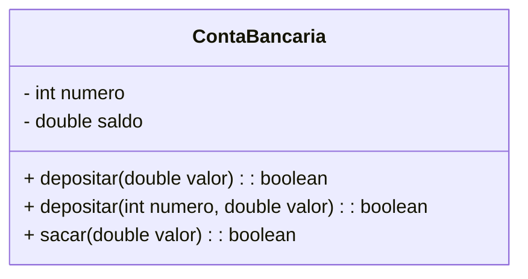

# Conta Bancária

```mermaid

classDiagram
    class ContaBancaria {

        - int numero
        - double saldo

        + depositar (double valor): boolean
        + depositar (int numero, double valor): boolean
        + sacar (double valor): boolean
    }

```